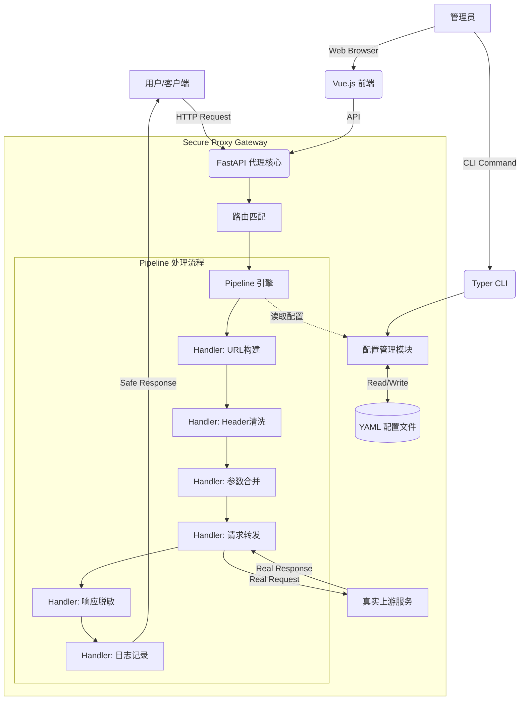

这份文档旨在提供一个清晰、可落地且专业的系统架构设计方案。你可以直接将其用于项目立项、代码开发指导或技术评审。

---

# 安全代理网关（Secure Proxy Gateway）技术设计文档

| 文档版本 | V2.0 |
| :--- | :--- |
| **技术栈** | Python 3.10+, FastAPI, HTTPX, Typer |
| **文档状态** | 正式版 |
| **作者** | Max |
| **核心架构** | Pipeline（双方法 Handler） |

---

## 1. 简介 (Introduction)

### 1.1 背景
在开发和测试过程中，服务器所处的网络环境复杂，且上游服务（Upstream）可能包含无法直接暴露的真实域名或 IP 地址。此外，响应数据中可能包含敏感信息（如身份证、手机号、API Key），直接透出存在安全风险。

### 1.2 目标
构建一个**轻量级、配置化、可扩展**的代理服务器，实现以下核心功能：
1.  **统一入口**：隐藏真实后端地址，通过代理服务器统一访问。
2.  **请求重写**：支持动态增加、删除请求参数（Query Params/Headers）。
3.  **响应脱敏**：基于正则规则对响应内容（Response Body）进行实时脱敏。
4.  **Pipeline 架构**：基于链式处理器，支持灵活扩展处理逻辑。
5.  **配置管理**：提供 CLI（命令行）和 Web UI 两种方式管理路由规则。

### 1.3 设计原则
*   **轻量优先**：保持核心功能精简，避免过度设计。
*   **安全可靠**：在轻量前提下，优先保障安全性和稳定性。
*   **配置驱动**：所有行为通过配置文件控制，无需修改代码。
*   **可扩展性**：通过 Pipeline 架构，支持按需插拔处理器。

### 1.4 适用场景
*   本地开发联调，需要访问受限的内网服务。
*   向第三方展示 Demo 时，需要隐藏真实后端架构和敏感数据。
*   简单的 API 网关模拟。

---

## 2. 系统架构 (System Architecture)

### 2.1 架构图
系统采用 **Pipeline（管道）架构**，请求和响应通过一系列 Handler 链式处理。



### 3.3.1 Handler 装配与配置映射

**目标**：保持“配置驱动 + 简洁”。

* 默认 Pipeline（按 order 排好）：`UrlBuild -> Header -> Params -> Forward -> Masking -> Logging`
* 配置规则：
  * 全局 `handlers` 段可开关/配置内置 Handler
  * 路由级可声明 `pipeline`，仅覆盖需要的 Handler 顺序/开关/参数，其余沿用默认
* 装配流程：
  1) 读取默认 Handler 列表  
  2) 应用全局 `handlers.*.enabled/params`  
  3) 若路由声明 `pipeline`，按其顺序覆盖同名 Handler（未声明的保持默认顺序与配置）  
  4) 缓存“路由名 -> Handler 实例列表”以便快速调度
* 配置示例：

```yaml
handlers:                      # 全局
  logging:
    enabled: true

routes:
  - name: "user-api"
    path: "/api/user"
    target: "https://real.com"
    pipeline:                  # 路由级覆盖
      - handler: "ratelimit"
        enabled: true
        config:
          max_requests: 100
          window_seconds: 60
      - handler: "masking"     # 复用默认 masking
```

### 2.2 Pipeline 执行流程（洋葱模型）

```
请求到达
    │
    ▼ ════════════════════════════════════
    │   REQUEST 阶段（正序执行）
    ▼ ════════════════════════════════════
┌─────────────────────────────────────────┐
│ [1] UrlBuildHandler.on_request()        │  → 构建上游 URL
├─────────────────────────────────────────┤
│ [2] HeaderHandler.on_request()          │  → 清洗/添加请求头
├─────────────────────────────────────────┤
│ [3] ParamsHandler.on_request()          │  → 合并/删除参数
├─────────────────────────────────────────┤
│ [4] ForwardHandler.on_request()         │  → 转发请求到上游
└─────────────────────────────────────────┘
    │
    ▼ ════════════════════════════════════
    │   RESPONSE 阶段（逆序执行 - 洋葱模型）
    ▼ ════════════════════════════════════
┌─────────────────────────────────────────┐
│ [4] ForwardHandler.on_response()        │  → (无操作)
├─────────────────────────────────────────┤
│ [3] ParamsHandler.on_response()         │  → (无操作)
├─────────────────────────────────────────┤
│ [2] HeaderHandler.on_response()         │  → 清理响应头
├─────────────────────────────────────────┤
│ [1] MaskingHandler.on_response()        │  → 执行脱敏
└─────────────────────────────────────────┘
    │
    ▼
返回响应给客户端
```

### 2.3 核心组件
1.  **Pipeline Engine**: 核心调度引擎，负责按序执行 Handler 链。
2.  **Handler（处理器）**: 独立的处理单元，每个 Handler 可实现 `on_request` 和/或 `on_response` 方法。
3.  **ProxyContext**: 请求上下文对象，贯穿整个 Pipeline，承载请求/响应数据。
4.  **Config Manager**: 负责配置文件的加载、校验、持久化（YAML格式）。
5.  **HTTP Client**: 基于 `HTTPX`，处理异步 HTTP 请求转发。
6.  **Interfaces**:
    *   **CLI**: 基于 `Typer`，提供脚本化管理能力。
    *   **Web UI**: 基于 Jinja2 + Vue.js (CDN)，提供可视化管理面板。

---

## 3. Pipeline 核心设计

### 3.1 ProxyContext（请求上下文）

`ProxyContext` 是贯穿整个 Pipeline 的数据载体，所有 Handler 通过它共享和传递数据。

```python
from dataclasses import dataclass, field
from typing import Optional, Any
from fastapi import Request, Response

@dataclass
class ProxyContext:
    """请求上下文 - 贯穿整个 Pipeline 的数据载体"""
    
    # ===== 原始请求 =====
    request: Request                      # FastAPI 原始请求对象
    route: "RouteConfig"                  # 匹配到的路由配置
    
    # ===== 构建的上游请求 =====
    upstream_url: str = ""                # 目标 URL
    upstream_method: str = ""             # 请求方法
    upstream_headers: dict = field(default_factory=dict)   # 请求头
    upstream_params: dict = field(default_factory=dict)    # Query 参数
    upstream_body: bytes = b""            # 请求体
    
    # ===== 上游响应 =====
    response: Optional[Response] = None   # 最终响应对象
    response_body: bytes = b""            # 响应体（可被修改）
    response_headers: dict = field(default_factory=dict)   # 响应头
    response_status: int = 200            # 响应状态码
    
    # ===== 控制标志 =====
    skip_upstream: bool = False           # 跳过上游调用（用于缓存命中等）
    skip_response_processing: bool = False  # 跳过响应处理（用于流式透传）
    
    # ===== 元数据 =====
    request_id: str = ""                  # 请求追踪 ID
    start_time: float = 0.0               # 请求开始时间
    upstream_latency_ms: float = 0.0      # 上游响应耗时
    metadata: dict[str, Any] = field(default_factory=dict)  # 扩展数据
```

### 3.2 Handler 基类

采用**双方法设计**，每个 Handler 可以选择性实现 `on_request` 和/或 `on_response`。

```python
from abc import ABC
from typing import Optional

class Handler(ABC):
    """
    处理器基类
    
    - on_request: 请求阶段处理（正序执行）
    - on_response: 响应阶段处理（逆序执行）
    
    子类可选择性覆盖其中一个或两个方法。
    """
    
    async def on_request(self, ctx: ProxyContext) -> ProxyContext:
        """
        请求阶段处理
        
        执行顺序：按 order 从小到大正序执行
        典型用途：修改请求头、参数、URL 等
        
        Args:
            ctx: 请求上下文
        Returns:
            修改后的上下文（或原样返回）
        """
        return ctx
    
    async def on_response(self, ctx: ProxyContext) -> ProxyContext:
        """
        响应阶段处理
        
        执行顺序：按 order 从大到小逆序执行（洋葱模型）
        典型用途：修改响应体、脱敏、日志记录等
        
        Args:
            ctx: 请求上下文（包含响应数据）
        Returns:
            修改后的上下文
        """
        return ctx
    
    @property
    def name(self) -> str:
        """Handler 名称，用于日志和调试"""
        return self.__class__.__name__
    
    @property
    def order(self) -> int:
        """
        执行优先级
        
        - 数值越小，on_request 越先执行
        - 数值越小，on_response 越后执行（洋葱模型）
        - 默认值 100
        """
        return 100
    
    @property
    def enabled(self) -> bool:
        """是否启用此 Handler"""
        return True
```

### 3.3 Pipeline 引擎

```python
import time
import uuid
import logging
from typing import List
from fastapi import Response

logger = logging.getLogger(__name__)

class Pipeline:
    """Pipeline 执行引擎"""
    
    def __init__(self):
        self._handlers: List[Handler] = []
    
    def register(self, handler: Handler) -> "Pipeline":
        """注册 Handler"""
        self._handlers.append(handler)
        # 按 order 排序
        self._handlers.sort(key=lambda h: h.order)
        return self
    
    def clear(self) -> None:
        """清空所有 Handler"""
        self._handlers.clear()
    
    async def execute(self, ctx: ProxyContext) -> Response:
        """
        执行 Pipeline
        
        流程：
        1. 初始化上下文元数据
        2. 正序执行所有 Handler 的 on_request
        3. 逆序执行所有 Handler 的 on_response
        4. 返回最终 Response
        """
        # 初始化
        ctx.request_id = ctx.request.headers.get(
            "X-Request-Id", 
            str(uuid.uuid4())[:8]
        )
        ctx.start_time = time.time()
        ctx.upstream_method = ctx.request.method
        
        active_handlers = [h for h in self._handlers if h.enabled]
        
        # ===== REQUEST 阶段：正序执行 =====
        for handler in active_handlers:
            try:
                ctx = await handler.on_request(ctx)
                logger.debug(f"[{ctx.request_id}] {handler.name}.on_request completed")
            except Exception as e:
                logger.error(f"[{ctx.request_id}] {handler.name}.on_request failed: {e}")
                return self._error_response(ctx, 500, f"Handler error: {handler.name}")
            
            # 支持短路（如缓存命中）
            if ctx.skip_upstream and ctx.response:
                logger.info(f"[{ctx.request_id}] Pipeline short-circuited at {handler.name}")
                break
        
        # ===== RESPONSE 阶段：逆序执行（洋葱模型）=====
        # 即便发生流式透传，也执行响应阶段，用于 header 清理、日志等。
        for handler in reversed(active_handlers):
            try:
                ctx = await handler.on_response(ctx)
                logger.debug(f"[{ctx.request_id}] {handler.name}.on_response completed")
            except Exception as e:
                logger.error(f"[{ctx.request_id}] {handler.name}.on_response failed: {e}")
                # 响应阶段错误不中断，继续执行
        
        # 计算总耗时
        total_ms = (time.time() - ctx.start_time) * 1000
        logger.info(
            f"[{ctx.request_id}] Pipeline completed: "
            f"status={ctx.response_status}, total={total_ms:.1f}ms, "
            f"upstream={ctx.upstream_latency_ms:.1f}ms"
        )
        
        return ctx.response or self._build_response(ctx)
    
    def _build_response(self, ctx: ProxyContext) -> Response:
        """从 Context 构建 Response"""
        if ctx.response_headers and "content-type" not in {k.lower() for k in ctx.response_headers}:
            # 为无显式 content-type 的情况兜底
            ctx.response_headers["content-type"] = "application/json"
        return Response(
            content=ctx.response_body,
            status_code=ctx.response_status,
            headers=ctx.response_headers,
        )
    
    def _error_response(self, ctx: ProxyContext, status: int, message: str) -> Response:
        """构建错误响应"""
        from fastapi.responses import JSONResponse
        return JSONResponse(
            status_code=status,
            content={
                "error": message,
                "request_id": ctx.request_id,
                "path": str(ctx.request.url.path)
            }
        )
```

### 3.4 内置 Handler 实现

#### 3.4.1 UrlBuildHandler（URL 构建）

```python
class UrlBuildHandler(Handler):
    """构建上游请求 URL"""
    
    @property
    def order(self) -> int:
        return 10  # 最先执行
    
    async def on_request(self, ctx: ProxyContext) -> ProxyContext:
        # 替换路径前缀，构建上游 URL
        request_path = ctx.request.url.path
        upstream_path = request_path.replace(ctx.route.path, "", 1)
        ctx.upstream_url = ctx.route.target.rstrip("/") + upstream_path
        
        # 复制原始请求体
        ctx.upstream_body = await ctx.request.body()
        
        return ctx
```

#### 3.4.2 HeaderHandler（请求头处理）

```python
class HeaderHandler(Handler):
    """处理请求头：清洗 + 添加"""
    
    @property
    def order(self) -> int:
        return 20
    
    async def on_request(self, ctx: ProxyContext) -> ProxyContext:
        config = get_config()
        strip_set = {h.lower() for h in config.proxy.strip_headers}
        
        # 1. 复制原始 Header（排除黑名单）
        ctx.upstream_headers = {
            k: v for k, v in ctx.request.headers.items()
            if k.lower() not in strip_set
        }
        
        # 2. 添加路由配置的自定义 Header
        ctx.upstream_headers.update(ctx.route.request_rules.add_headers)
        
        # 3. 添加代理标识
        ctx.upstream_headers["X-Forwarded-For"] = ctx.request.client.host
        ctx.upstream_headers["X-Request-Id"] = ctx.request_id
        
        return ctx
    
    async def on_response(self, ctx: ProxyContext) -> ProxyContext:
        # 清理响应头中的敏感信息
        hop_by_hop = {"connection", "keep-alive", "transfer-encoding"}
        ctx.response_headers = {
            k: v for k, v in ctx.response_headers.items()
            if k.lower() not in hop_by_hop
        }
        # 若已有 Response 对象（如流式透传），同步更新头
        if ctx.response:
            for h in hop_by_hop:
                ctx.response.headers.pop(h, None)
            ctx.response.headers.update(ctx.response_headers)
        return ctx
```

#### 3.4.3 ParamsHandler（参数处理）

```python
class ParamsHandler(Handler):
    """处理 Query 参数：合并 + 删除"""
    
    @property
    def order(self) -> int:
        return 30
    
    async def on_request(self, ctx: ProxyContext) -> ProxyContext:
        # 1. 复制原始参数
        ctx.upstream_params = dict(ctx.request.query_params)
        
        # 2. 添加配置的参数
        ctx.upstream_params.update(ctx.route.request_rules.add_params)
        
        # 3. 删除指定参数
        for key in ctx.route.request_rules.del_params:
            ctx.upstream_params.pop(key, None)
        
        return ctx
```

#### 3.4.4 ForwardHandler（请求转发）

```python
import httpx
import time
import json

class ForwardHandler(Handler):
    """转发请求到上游服务"""
    
    @property
    def order(self) -> int:
        return 50  # 中间位置
    
    async def on_request(self, ctx: ProxyContext) -> ProxyContext:
        if ctx.skip_upstream:
            return ctx
        
        client = get_http_client()
        config = get_config()
        
        start = time.time()
        try:
            upstream_resp = await client.request(
                method=ctx.upstream_method,
                url=ctx.upstream_url,
                params=ctx.upstream_params,
                headers=ctx.upstream_headers,
                content=ctx.upstream_body,
            )
            ctx.upstream_latency_ms = (time.time() - start) * 1000
            
            # 检查是否需要流式透传（大文件/二进制）
            content_type = upstream_resp.headers.get("content-type", "")
            content_length = int(upstream_resp.headers.get("content-length", 0))
            
            if (content_length > config.proxy.max_response_size or 
                not self._is_text_content(content_type)):
                # 流式透传，跳过后续响应处理
                ctx.skip_response_processing = True
                ctx.response = StreamingResponse(
                    upstream_resp.aiter_bytes(),
                    status_code=upstream_resp.status_code,
                    headers=dict(upstream_resp.headers)
                )
                # 保留头部供 on_response 进行 hop-by-hop 清理
                ctx.response_headers = dict(upstream_resp.headers)
            else:
                # 读取响应内容，供后续 Handler 处理
                ctx.response_body = upstream_resp.content
                ctx.response_status = upstream_resp.status_code
                ctx.response_headers = dict(upstream_resp.headers)
                
        except httpx.ConnectError:
            ctx.response_status = 502
            ctx.response_body = json.dumps({
                "error": "Bad Gateway",
                "request_id": ctx.request_id,
                "path": str(ctx.request.url.path)
            }).encode()
            ctx.response_headers = {"content-type": "application/json"}
        except httpx.TimeoutException:
            ctx.response_status = 504
            ctx.response_body = json.dumps({
                "error": "Gateway Timeout",
                "request_id": ctx.request_id,
                "path": str(ctx.request.url.path)
            }).encode()
            ctx.response_headers = {"content-type": "application/json"}
        
        return ctx
    
    def _is_text_content(self, content_type: str) -> bool:
        """判断是否为可处理的文本内容"""
        text_types = {
            "application/json", "text/html", "text/xml",
            "text/plain", "application/xml", "application/javascript"
        }
        base_type = content_type.split(";")[0].strip().lower()
        return base_type in text_types
```

#### 3.4.5 MaskingHandler（响应脱敏）

```python
import re

class MaskingHandler(Handler):
    """响应内容脱敏"""
    
    @property
    def order(self) -> int:
        return 80  # 靠后执行
    
    async def on_response(self, ctx: ProxyContext) -> ProxyContext:
        if not ctx.response_body or ctx.skip_response_processing:
            return ctx
        
        # 只处理文本内容
        try:
            content = ctx.response_body.decode("utf-8")
        except UnicodeDecodeError:
            return ctx
        
        # 执行脱敏规则
        for rule in ctx.route.response_rules.mask_regex:
            content = re.sub(rule.pattern, rule.replacement, content)
        
        ctx.response_body = content.encode("utf-8")
        
        # 更新 Content-Length
        ctx.response_headers["content-length"] = str(len(ctx.response_body))
        
        return ctx
```

#### 3.4.6 LoggingHandler（日志记录）

```python
import logging

class LoggingHandler(Handler):
    """请求日志记录"""
    
    def __init__(self):
        self.logger = logging.getLogger("proxy.access")
    
    @property
    def order(self) -> int:
        return 200  # 最后执行
    
    async def on_response(self, ctx: ProxyContext) -> ProxyContext:
        total_ms = (time.time() - ctx.start_time) * 1000
        
        self.logger.info(
            "",
            extra={
                "request_id": ctx.request_id,
                "method": ctx.request.method,
                "path": str(ctx.request.url.path),
                "route_name": ctx.route.name,
                "upstream_url": ctx.upstream_url,
                "status_code": ctx.response_status,
                "upstream_ms": round(ctx.upstream_latency_ms, 1),
                "total_ms": round(total_ms, 1),
            }
        )
        return ctx
```

---

## 4. 数据设计 (Data Design)

### 4.1 配置文件结构 (`config.yaml`)

配置采用 YAML 格式，支持 Pipeline Handler 的声明式配置。

```yaml
server:
  port: 8000
  host: "127.0.0.1"              # 默认仅本地访问
  admin_host: "127.0.0.1"        # 管理接口绑定地址

proxy:
  timeout:
    connect: 5.0                 # 连接超时（秒）
    read: 30.0                   # 读取超时（秒）
    write: 30.0                  # 写入超时（秒）
  max_response_size: 10485760    # 响应体大小上限（10MB）
  
  # Header 黑名单（不转发给上游）
  strip_headers:
    - "Host"
    - "Connection"
    - "Transfer-Encoding"
    - "Upgrade"
    - "Proxy-Connection"
    - "Proxy-Authenticate"
    - "Proxy-Authorization"

# 全局 Handler 配置（可选）
handlers:
  logging:
    enabled: true
    level: "INFO"

routes:
  - name: "user-api"
    path: "/api/user"
    target: "https://real-server.com/v1"
    method: "*"
    description: "用户服务代理"
    pipeline:                  # 可选：覆盖/插拔 Handler
      - handler: "ratelimit"
        enabled: false         # 默认关闭
        config:
          max_requests: 100
          window_seconds: 60
    
    # 请求处理规则
    request_rules:
      add_params:
        source: "proxy_gw"
      add_headers:
        Authorization: "Bearer xxx"
      del_params:
        - "debug_mode"
    
    # 响应处理规则
    response_rules:
      mask_regex:
        - pattern: "(\\d{3})\\d{4}(\\d{4})"
          replacement: "\\1****\\2"
          description: "手机号脱敏"
        - pattern: "(\\d{6})\\d{8}(\\d{4})"
          replacement: "\\1********\\2"
          description: "身份证脱敏"
```

### 4.2 数据模型 (Pydantic Models)

```python
from pydantic import BaseModel, Field, field_validator
from typing import List, Dict, Optional
import re

class TimeoutConfig(BaseModel):
    connect: float = 5.0
    read: float = 30.0
    write: float = 30.0

class ProxyConfig(BaseModel):
    timeout: TimeoutConfig = Field(default_factory=TimeoutConfig)
    max_response_size: int = 10 * 1024 * 1024  # 10MB
    strip_headers: List[str] = [
        "Host", "Connection", "Transfer-Encoding", 
        "Upgrade", "Proxy-Connection", 
        "Proxy-Authenticate", "Proxy-Authorization"
    ]

class ServerConfig(BaseModel):
    port: int = 8000
    host: str = "127.0.0.1"
    admin_host: str = "127.0.0.1"

class RequestRules(BaseModel):
    """请求处理规则"""
    add_params: Dict[str, str] = Field(default_factory=dict)
    add_headers: Dict[str, str] = Field(default_factory=dict)
    del_params: List[str] = Field(default_factory=list)

class MaskRule(BaseModel):
    """脱敏规则"""
    pattern: str
    replacement: str
    description: Optional[str] = None
    
    @field_validator('pattern')
    @classmethod
    def validate_pattern(cls, v: str) -> str:
        if len(v) > 500:
            raise ValueError('正则表达式长度不能超过 500 字符')
        try:
            re.compile(v)
        except re.error as e:
            raise ValueError(f'无效的正则表达式: {e}')
        return v

class ResponseRules(BaseModel):
    """响应处理规则"""
    mask_regex: List[MaskRule] = Field(default_factory=list)

class RouteConfig(BaseModel):
    """路由配置"""
    name: str
    path: str
    target: str
    method: str = "*"
    description: Optional[str] = None
    request_rules: RequestRules = Field(default_factory=RequestRules)
    response_rules: ResponseRules = Field(default_factory=ResponseRules)

class HandlerConfig(BaseModel):
    """Handler 全局配置"""
    logging: Dict[str, any] = Field(default_factory=lambda: {"enabled": True})

class SystemConfig(BaseModel):
    """系统总配置"""
    server: ServerConfig = Field(default_factory=ServerConfig)
    proxy: ProxyConfig = Field(default_factory=ProxyConfig)
    handlers: HandlerConfig = Field(default_factory=HandlerConfig)
    routes: List[RouteConfig] = Field(default_factory=list)
```

---

## 5. 模块详细设计 (Module Design)

### 5.1 主入口与 Pipeline 初始化

```python
from contextlib import asynccontextmanager
from fastapi import FastAPI, Request
import httpx

# 全局实例
_pipeline: Pipeline | None = None
_http_client: httpx.AsyncClient | None = None

def create_pipeline() -> Pipeline:
    """创建并配置 Pipeline"""
    pipeline = Pipeline()
    
    # 按顺序注册内置 Handler
    pipeline.register(UrlBuildHandler())      # order=10
    pipeline.register(HeaderHandler())        # order=20
    pipeline.register(ParamsHandler())        # order=30
    pipeline.register(ForwardHandler())       # order=50
    pipeline.register(MaskingHandler())       # order=80
    pipeline.register(LoggingHandler())       # order=200
    
    return pipeline

@asynccontextmanager
async def lifespan(app: FastAPI):
    """应用生命周期管理"""
    global _pipeline, _http_client
    
    config = get_config()
    
    # 初始化 HTTP 客户端
    _http_client = httpx.AsyncClient(
        timeout=httpx.Timeout(
            connect=config.proxy.timeout.connect,
            read=config.proxy.timeout.read,
            write=config.proxy.timeout.write,
        ),
        follow_redirects=False,
        limits=httpx.Limits(max_connections=100, max_keepalive_connections=20)
    )
    
    # 初始化 Pipeline
    _pipeline = create_pipeline()
    
    yield
    
    await _http_client.aclose()

app = FastAPI(lifespan=lifespan)

@app.api_route("/{path:path}", methods=["GET", "POST", "PUT", "DELETE", "PATCH"])
async def proxy_handler(request: Request, path: str):
    """代理入口 - 所有非管理 API 的请求"""
    config = get_config()
    
    # 路由匹配
    route = match_route(f"/{path}", request.method, config.routes)
    if not route:
        return JSONResponse(
            status_code=404,
            content={"error": "No matching route", "path": f"/{path}"}
        )
    
    # 创建上下文并执行 Pipeline
    ctx = ProxyContext(request=request, route=route)
    return await _pipeline.execute(ctx)
```

### 5.2 路由匹配（最长前缀优先）

```python
def match_route(path: str, method: str, routes: List[RouteConfig]) -> RouteConfig | None:
    """匹配路由，最长前缀优先"""
    sorted_routes = sorted(routes, key=lambda r: len(r.path), reverse=True)
    
    for route in sorted_routes:
        if path.startswith(route.path):
            if route.method == "*" or route.method.upper() == method.upper():
                return route
    return None
```

### 5.3 配置热加载策略

*   **内存配置 + 异步持久化**：每次请求读取内存中的 Config 对象。
*   **并发安全**：使用 `asyncio.Lock` 防止写文件冲突。
*   **原子写入**：写入临时文件后 `os.rename()` 覆盖。
*   **备份机制**：每次保存前备份为 `config.yaml.bak`。
*   **Pipeline 重建**：配置落盘成功后，重建“路由名 -> Handler 列表”的缓存，确保新路由/顺序即时生效。

### 5.4 HTTPX 客户端管理

```python
def get_http_client() -> httpx.AsyncClient:
    """获取全局 HTTP 客户端"""
    if _http_client is None:
        raise RuntimeError("HTTP client not initialized")
    return _http_client
```

### 5.5 Web UI 界面设计

*   **路由**：
    *   `GET /ui`: 返回管理面板 HTML。
    *   `GET /api/config`: 获取当前 JSON 配置。
    *   `POST /api/config`: 保存全量配置。
    *   `GET /healthz`: 健康检查端点。
*   **功能**：
    *   路由列表展示（卡片式）。
    *   表单编辑：路径、目标 URL、增删改参数。
    *   正则测试区：输入样例文本和正则，实时预览脱敏结果。

### 5.6 命令行工具 (CLI)

基于 `Typer` 实现：
*   `proxy start`: 启动代理服务器。
*   `proxy add <path> <target>`: 交互式添加路由。
*   `proxy ls`: 表格化展示当前规则。
*   `proxy rm <name>`: 删除指定路由。
*   `proxy mask <name> --pattern <regex> --repl <str>`: 添加脱敏规则。
*   `proxy validate`: 校验配置文件合法性。

---

## 6. 项目目录结构 (Project Structure)

```text
secure-proxy/
├── config.yaml                # 配置文件
├── config.yaml.bak            # 配置备份（自动生成）
├── requirements.txt           # 依赖定义
├── src/
│   ├── __init__.py
│   ├── main.py                # 程序入口 (FastAPI app)
│   ├── core/
│   │   ├── __init__.py
│   │   ├── config.py          # 配置加载与保存
│   │   ├── models.py          # Pydantic 数据模型
│   │   └── exceptions.py      # 统一异常定义
│   ├── pipeline/              # Pipeline 核心（新增）
│   │   ├── __init__.py
│   │   ├── context.py         # ProxyContext 定义
│   │   ├── base.py            # Handler 基类
│   │   ├── engine.py          # Pipeline 引擎
│   │   └── handlers/          # 内置 Handler
│   │       ├── __init__.py
│   │       ├── url_build.py   # URL 构建
│   │       ├── header.py      # Header 处理
│   │       ├── params.py      # 参数处理
│   │       ├── forward.py     # 请求转发
│   │       ├── masking.py     # 响应脱敏
│   │       └── logging.py     # 日志记录
│   ├── proxy/
│   │   ├── __init__.py
│   │   ├── client.py          # HTTPX 客户端管理
│   │   └── routing.py         # 路由匹配逻辑
│   ├── cli/
│   │   ├── __init__.py
│   │   └── commands.py        # Typer 命令行实现
│   └── web/
│       ├── __init__.py
│       ├── routers.py         # UI 相关的 API 路由
│       └── templates/
│           └── index.html
└── tests/
    ├── test_pipeline.py       # Pipeline 测试（新增）
    ├── test_handlers.py       # Handler 单元测试（新增）
    ├── test_routing.py        # 路由匹配测试
    ├── test_masking.py        # 脱敏逻辑测试
    └── test_config.py         # 配置加载测试
```

---

## 7. 扩展 Handler 示例

Pipeline 架构的最大优势是**易于扩展**。以下是几个扩展示例：

### 7.1 缓存 Handler（同时处理请求和响应）

```python
class CacheHandler(Handler):
    """响应缓存 - 演示双阶段 Handler"""
    
    def __init__(self, cache_store: dict = None):
        self._cache = cache_store or {}
    
    @property
    def order(self) -> int:
        return 5  # 最先执行，可短路
    
    async def on_request(self, ctx: ProxyContext) -> ProxyContext:
        cache_key = f"{ctx.request.method}:{ctx.request.url}"
        
        if cache_key in self._cache:
            cached = self._cache[cache_key]
            ctx.response_body = cached["body"]
            ctx.response_status = cached["status"]
            ctx.response_headers = cached["headers"]
            ctx.skip_upstream = True  # 跳过上游调用
            ctx.metadata["cache_hit"] = True
        
        ctx.metadata["cache_key"] = cache_key
        return ctx
    
    async def on_response(self, ctx: ProxyContext) -> ProxyContext:
        # 缓存成功响应
        if not ctx.metadata.get("cache_hit") and ctx.response_status == 200:
            cache_key = ctx.metadata.get("cache_key")
            if cache_key:
                self._cache[cache_key] = {
                    "body": ctx.response_body,
                    "status": ctx.response_status,
                    "headers": ctx.response_headers,
                }
        return ctx
```

> 示例未实现过期/淘汰策略；生产建议使用带 TTL 的缓存（如 Redis），并控制最大键空间。

### 7.2 限流 Handler

```python
from collections import defaultdict
import time

class RateLimitHandler(Handler):
    """简单限流"""
    
    def __init__(self, max_requests: int = 100, window_seconds: int = 60):
        self._max_requests = max_requests
        self._window = window_seconds
        self._counters: dict = defaultdict(list)
    
    @property
    def order(self) -> int:
        return 1  # 最先执行
    
    async def on_request(self, ctx: ProxyContext) -> ProxyContext:
        client_ip = ctx.request.client.host
        now = time.time()
        
        # 清理过期记录
        self._counters[client_ip] = [
            t for t in self._counters[client_ip] 
            if now - t < self._window
        ]
        
        if len(self._counters[client_ip]) >= self._max_requests:
            ctx.response_status = 429
            ctx.response_body = b'{"error": "Too Many Requests"}'
            ctx.response_headers = {"content-type": "application/json"}
            ctx.skip_upstream = True
        else:
            self._counters[client_ip].append(now)
        
        return ctx
```

> 生产环境建议使用 Redis/滑动窗口并加锁；上述示例仅适用于单进程内存模式。

### 7.3 请求签名 Handler

```python
import hashlib
import hmac

class SignatureHandler(Handler):
    """请求签名"""
    
    def __init__(self, secret_key: str):
        self._secret = secret_key.encode()
    
    @property
    def order(self) -> int:
        return 40  # 在参数处理之后
    
    async def on_request(self, ctx: ProxyContext) -> ProxyContext:
        # 生成签名
        sign_string = f"{ctx.upstream_method}:{ctx.upstream_url}"
        signature = hmac.new(self._secret, sign_string.encode(), hashlib.sha256).hexdigest()
        ctx.upstream_headers["X-Signature"] = signature
        return ctx
```

---

### 7.4 TargetGuardHandler（出站目标校验 / SSRF 防护）

```python
import ipaddress
import socket

class TargetGuardHandler(Handler):
    """基于域名/IP 白名单的目标校验，阻断内网/元数据地址"""
    
    def __init__(self, allow_hosts: list[str], allow_cidrs: list[str]):
        self._allow_hosts = {h.lower() for h in allow_hosts}
        self._allow_nets = [ipaddress.ip_network(c) for c in allow_cidrs]
    
    @property
    def order(self) -> int:
        return 8  # 在 URL 构建之后、转发之前
    
    async def on_request(self, ctx: ProxyContext) -> ProxyContext:
        hostname = ctx.upstream_url.split("/")[2].split(":")[0]
        if hostname.lower() not in self._allow_hosts:
            ctx.response_status = 403
            ctx.response_body = b'{"error": "target not allowed"}'
            ctx.response_headers = {"content-type": "application/json"}
            ctx.skip_upstream = True
            return ctx
        
        # DNS 解析并校验 IP 是否落在允许网段
        for family in (socket.AF_INET, socket.AF_INET6):
            try:
                infos = socket.getaddrinfo(hostname, None, family=family)
                for info in infos:
                    ip_obj = ipaddress.ip_address(info[4][0])
                    if any(ip_obj in net for net in self._allow_nets):
                        return ctx
            except socket.gaierror:
                continue
        
        ctx.response_status = 403
        ctx.response_body = b'{"error": "target ip rejected"}'
        ctx.response_headers = {"content-type": "application/json"}
        ctx.skip_upstream = True
        return ctx
```

> 生产环境建议补充 DNS 反查/缓存、保留网段黑名单和失败告警。

### 7.5 SizeLimitHandler（请求/响应大小限制）

```python
class SizeLimitHandler(Handler):
    """基于 content-length/分块累计的大小限制，保护内存"""
    
    def __init__(self, max_req_bytes: int = 2 * 1024 * 1024, max_resp_bytes: int = 10 * 1024 * 1024):
        self._max_req = max_req_bytes
        self._max_resp = max_resp_bytes
    
    @property
    def order(self) -> int:
        return 15  # 在 URL/认证之后、转发之前
    
    async def on_request(self, ctx: ProxyContext) -> ProxyContext:
        length = int(ctx.request.headers.get("content-length", 0) or 0)
        if length and length > self._max_req:
            ctx.response_status = 413
            ctx.response_body = b'{"error": "request too large"}'
            ctx.response_headers = {"content-type": "application/json"}
            ctx.skip_upstream = True
        return ctx
    
    async def on_response(self, ctx: ProxyContext) -> ProxyContext:
        if ctx.skip_response_processing or not ctx.response_body:
            return ctx
        if len(ctx.response_body) > self._max_resp:
            ctx.response_status = 502
            ctx.response_body = b'{"error": "response too large"}'
            ctx.response_headers = {"content-type": "application/json"}
        return ctx
```

> 与 ForwardHandler 的流式转发结合使用时，应在流式读取过程中累加字节数并中断超限。

### 7.6 DecompressMaskHandler（解压后脱敏）

```python
import gzip
import io

class DecompressMaskHandler(Handler):
    """对 gzip/deflate 文本响应解压后再交给脱敏逻辑"""
    
    def __init__(self, masking: MaskingHandler):
        self._masking = masking
    
    @property
    def order(self) -> int:
        return 70  # 在 MaskingHandler 前
    
    async def on_response(self, ctx: ProxyContext) -> ProxyContext:
        if ctx.skip_response_processing or not ctx.response_body:
            return ctx
        encoding = ctx.response_headers.get("content-encoding", "").lower()
        if encoding == "gzip":
            with gzip.GzipFile(fileobj=io.BytesIO(ctx.response_body)) as f:
                ctx.response_body = f.read()
            ctx.response_headers.pop("content-encoding", None)
        # 可扩展支持 deflate/br
        ctx = await self._masking.on_response(ctx)  # 复用已有脱敏
        return ctx
```

> 若需要 JSON 字段级脱敏，可再加 `JsonMaskHandler` 专门解析/修改字段后输出。

---

## 8. 安全设计 (Security)

### 8.1 访问控制
*   **管理接口隔离**：`/ui` 和 `/api/*` 默认仅监听 `127.0.0.1`。
*   **代理接口**：可配置监听 `0.0.0.0` 对外提供服务。

### 8.2 输入校验
*   **正则防护**：限制正则表达式长度（≤500字符），防止 ReDoS 攻击。
*   **配置校验**：所有配置通过 Pydantic 严格校验。

### 8.3 SSRF 防护
*   **目标白名单（可选）**：后续版本可增加 `allowed_targets` 配置。

### 8.4 信息泄露防护
*   **错误响应**：不暴露内部堆栈信息。
*   **日志脱敏**：日志中不记录完整请求体和响应体。

---

## 9. 可观测性 (Observability)

### 9.1 健康检查

```python
@app.get("/healthz")
async def health_check():
    return {
        "status": "ok",
        "version": "2.0.0",
        "handlers": [h.name for h in _pipeline._handlers]
    }
```

### 9.2 结构化日志

```python
import logging
import json

class JSONFormatter(logging.Formatter):
    def format(self, record):
        log_data = {
            "timestamp": self.formatTime(record),
            "level": record.levelname,
            "message": record.getMessage(),
        }
        # 合并 extra 字段
        for key in ["request_id", "route_name", "method", "path", 
                    "status_code", "upstream_ms", "total_ms"]:
            if hasattr(record, key):
                log_data[key] = getattr(record, key)
        return json.dumps(log_data, ensure_ascii=False)
```

### 9.3 请求日志示例

```json
{
  "timestamp": "2024-01-15 10:30:45",
  "level": "INFO",
  "request_id": "a1b2c3d4",
  "route_name": "user-api",
  "method": "GET",
  "path": "/api/user/123",
  "upstream_url": "https://real-server.com/v1/123",
  "status_code": 200,
  "upstream_ms": 45.2,
  "total_ms": 48.7
}
```

---

## 10. 开发计划 (Implementation Plan)

### Phase 1 (核心 Pipeline) - 必须实现
*   实现 `ProxyContext` 和 `Handler` 基类。
*   实现 `Pipeline` 引擎（正序/逆序执行）。
*   实现内置 Handler：
    *   `UrlBuildHandler`
    *   `HeaderHandler`
    *   `ParamsHandler`
    *   `ForwardHandler`
    *   `MaskingHandler`
    *   `LoggingHandler`
*   完成 Pydantic 模型定义。
*   实现基于 YAML 的配置读写。
*   路由匹配：最长前缀优先。
*   健康检查端点。

### Phase 2 (CLI)
*   集成 Typer，实现 CRUD 命令。
*   配置校验命令。
*   结构化日志输出。

### Phase 3 (UI & 安全增强)
*   开发 Vue 单页管理界面。
*   管理接口 Basic Auth 认证。
*   正则测试沙盒。

### Phase 4 (扩展 & 交付)
*   实现可选 Handler：CacheHandler、RateLimitHandler。
*   打包为 Docker 镜像。
*   编写使用文档。
*   补充单元测试覆盖。

---

## 11. 依赖清单 (Dependencies)

```text
# requirements.txt
fastapi>=0.109.0
uvicorn[standard]>=0.27.0
httpx>=0.26.0
pydantic>=2.5.0
pyyaml>=6.0.1
typer[all]>=0.9.0
jinja2>=3.1.2
rich>=13.7.0          # CLI 表格输出
```

---

## 附录 A：Pipeline 架构优势总结

| 维度 | 传统设计 | Pipeline 架构 |
|------|----------|---------------|
| **可扩展性** | 新增功能需修改核心代码 | 只需添加新 Handler |
| **可配置性** | 功能固定，配置项有限 | 可按需组合 Handler |
| **可测试性** | 难以单独测试某个环节 | 每个 Handler 独立测试 |
| **复用性** | 逻辑耦合 | Handler 可跨项目复用 |
| **可观测性** | 难以追踪处理过程 | 可在每个 Handler 埋点 |
| **维护性** | 修改影响范围大 | 单个 Handler 修改隔离 |

---

## 附录 B：配置文件完整示例

```yaml
server:
  port: 8000
  host: "0.0.0.0"
  admin_host: "127.0.0.1"

proxy:
  timeout:
    connect: 5.0
    read: 30.0
    write: 30.0
  max_response_size: 10485760
  strip_headers:
    - "Host"
    - "Connection"
    - "Transfer-Encoding"
    - "Upgrade"
    - "Proxy-Connection"
    - "Proxy-Authenticate"
    - "Proxy-Authorization"

handlers:
  logging:
    enabled: true
    level: "INFO"

routes:
  - name: "user-service"
    path: "/api/users"
    target: "https://internal-user-service.local"
    method: "*"
    description: "用户服务代理"
    request_rules:
      add_headers:
        X-Proxy-Source: "secure-gateway"
      add_params:
        _from: "proxy"
      del_params:
        - "debug"
    response_rules:
      mask_regex:
        - pattern: "(\\d{3})\\d{4}(\\d{4})"
          replacement: "\\1****\\2"
          description: "手机号脱敏"
        - pattern: "(\\d{6})\\d{8}(\\d{4})"
          replacement: "\\1********\\2"
          description: "身份证脱敏"

  - name: "order-service"
    path: "/api/orders"
    target: "https://internal-order-service.local"
    method: "GET"
    description: "订单查询（只读）"
```
