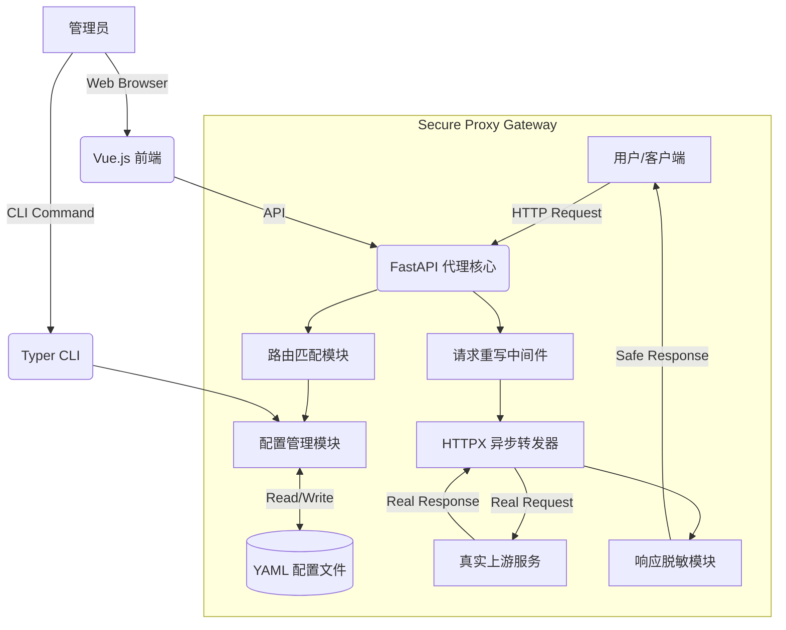

这份文档旨在提供一个清晰、可落地且专业的系统架构设计方案。你可以直接将其用于项目立项、代码开发指导或技术评审。

---

# 安全代理网关（Secure Proxy Gateway）技术设计文档

| 文档版本 | V1.1 |
| :--- | :--- |
| **技术栈** | Python 3.10+, FastAPI, HTTPX, Typer |
| **文档状态** | 正式版 |
| **作者** | Max |

---

## 1. 简介 (Introduction)

### 1.1 背景
在开发和测试过程中，服务器所处的网络环境复杂，且上游服务（Upstream）可能包含无法直接暴露的真实域名或 IP 地址。此外，响应数据中可能包含敏感信息（如身份证、手机号、API Key），直接透出存在安全风险。

### 1.2 目标
构建一个**轻量级、配置化**的代理服务器，实现以下核心功能：
1.  **统一入口**：隐藏真实后端地址，通过代理服务器统一访问。
2.  **请求重写**：支持动态增加、删除请求参数（Query Params/Headers）。
3.  **响应脱敏**：基于正则规则对响应内容（Response Body）进行实时脱敏。
4.  **配置管理**：提供 CLI（命令行）和 Web UI 两种方式管理路由规则。

### 1.3 设计原则
*   **轻量优先**：保持核心功能精简，避免过度设计。
*   **安全可靠**：在轻量前提下，优先保障安全性和稳定性。
*   **配置驱动**：所有行为通过配置文件控制，无需修改代码。

### 1.4 适用场景
*   本地开发联调，需要访问受限的内网服务。
*   向第三方展示 Demo 时，需要隐藏真实后端架构和敏感数据。
*   简单的 API 网关模拟。

---

## 2. 系统架构 (System Architecture)

### 2.1 架构图
系统采用单体分层架构，基于 Python 异步生态构建。



### 2.2 核心组件
1.  **Proxy Server (Server)**: 基于 `FastAPI` 和 `Uvicorn`，负责接收外部请求，是数据流转的枢纽。
2.  **Config Manager (Core)**: 负责配置文件的加载、校验、持久化（YAML格式）。
3.  **Forwarder (Client)**: 基于 `HTTPX`，处理异步 HTTP 请求转发，支持连接池复用和超时控制。
4.  **Data Masker**: 基于 Python `re` 模块，对文本流进行正则匹配和替换。
5.  **Interfaces**:
    *   **CLI**: 基于 `Typer`，提供脚本化管理能力。
    *   **Web UI**: 基于 Jinja2 + Vue.js (CDN)，提供可视化管理面板。

---

## 3. 数据设计 (Data Design)

### 3.1 配置文件结构 (`config.yaml`)
配置采用 YAML 格式，易于阅读和编辑。

```yaml
server:
  port: 8000
  host: "127.0.0.1"              # 默认仅本地访问，生产环境按需调整
  admin_host: "127.0.0.1"        # 管理接口绑定地址（安全考虑）

proxy:
  timeout:
    connect: 5.0                 # 连接超时（秒）
    read: 30.0                   # 读取超时（秒）
    write: 30.0                  # 写入超时（秒）
  max_response_size: 10485760    # 响应体大小上限（10MB），超过则直接流式透传

  # Header 处理黑名单（这些 Header 不会转发给上游）
  strip_headers:
    - "Host"
    - "Connection"
    - "Transfer-Encoding"
    - "Upgrade"
    - "Proxy-Connection"
    - "Proxy-Authenticate"
    - "Proxy-Authorization"

routes:
  - name: "user-api"             # 路由唯一标识（用于日志和管理）
    path: "/api/user"            # 代理入口路径前缀
    target: "https://real-server.com/v1" # 真实目标地址
    method: "GET"                # 限制方法，"*" 代表所有
    description: "用户查询接口"
    
    request_rules:               # 请求修改规则
      add_params:                # 追加 Query 参数
        source: "proxy_gw"
      add_headers:               # 追加 Header
        Authorization: "Bearer xxx"
      del_params:                # 删除参数
        - "debug_mode"

    response_rules:              # 响应处理规则
      mask_regex:                # 脱敏正则列表
        - pattern: "(\\d{3})\\d{4}(\\d{4})"  # 手机号正则
          replacement: "\\1****\\2"
```

### 3.2 数据模型 (Pydantic Models)
在代码层面，使用 Pydantic 严格定义数据结构，确保配置文件的合法性。

```python
from pydantic import BaseModel, Field, field_validator
from typing import List, Dict, Optional
import re

class TimeoutConfig(BaseModel):
    connect: float = 5.0
    read: float = 30.0
    write: float = 30.0

class ProxyConfig(BaseModel):
    timeout: TimeoutConfig = TimeoutConfig()
    max_response_size: int = 10 * 1024 * 1024  # 10MB
    strip_headers: List[str] = [
        "Host", "Connection", "Transfer-Encoding", 
        "Upgrade", "Proxy-Connection", 
        "Proxy-Authenticate", "Proxy-Authorization"
    ]

class ServerConfig(BaseModel):
    port: int = 8000
    host: str = "127.0.0.1"
    admin_host: str = "127.0.0.1"

class RequestRules(BaseModel):
    add_params: Dict[str, str] = {}
    add_headers: Dict[str, str] = {}
    del_params: List[str] = []

class MaskRule(BaseModel):
    pattern: str
    replacement: str
    
    @field_validator('pattern')
    @classmethod
    def validate_pattern(cls, v: str) -> str:
        # 正则长度校验，防止 ReDoS
        if len(v) > 500:
            raise ValueError('正则表达式长度不能超过 500 字符')
        # 校验正则合法性
        try:
            re.compile(v)
        except re.error as e:
            raise ValueError(f'无效的正则表达式: {e}')
        return v

class ResponseRules(BaseModel):
    mask_regex: List[MaskRule] = []

class RouteConfig(BaseModel):
    name: str                    # 路由唯一标识
    path: str
    target: str
    method: str = "*"
    description: Optional[str] = None
    request_rules: RequestRules = Field(default_factory=RequestRules)
    response_rules: ResponseRules = Field(default_factory=ResponseRules)

class SystemConfig(BaseModel):
    server: ServerConfig = Field(default_factory=ServerConfig)
    proxy: ProxyConfig = Field(default_factory=ProxyConfig)
    routes: List[RouteConfig] = []
```

---

## 4. 模块详细设计 (Module Design)

### 4.1 路由匹配与请求处理 (Proxy Logic)
**逻辑流程**：
1.  **捕获路径**：使用 FastAPI 的 `/{path:path}` 捕获所有非系统 API 请求。
2.  **查找配置**：遍历 `routes` 列表（**按 path 长度降序排列，最长前缀优先匹配**），使用 `startswith` 匹配请求路径。
3.  **Request 重写**：
    *   复制原始请求的 Query Parameters。
    *   遍历 `add_params` 进行合并。
    *   遍历 `del_params` 进行剔除。
    *   构造新的 Header（根据 `strip_headers` 配置剔除指定 Header）。
4.  **转发**：使用全局 `httpx.AsyncClient` 单例发起请求（连接池复用）。
5.  **Response 处理**：
    *   检查 `Content-Length`，超过 `max_response_size` 则直接流式透传。
    *   读取上游响应内容（Text）。
    *   遍历 `mask_regex`，执行 `re.sub(pattern, replacement, content)`。
    *   重组 Response 对象返回给客户端。

**异常处理**：
*   若未匹配到路由：返回 `404 Not Found`。
*   若上游服务连接失败：返回 `502 Bad Gateway`。
*   若上游服务超时：返回 `504 Gateway Timeout`。
*   所有错误响应采用统一格式：`{"error": "...", "request_id": "..."}`。

### 4.2 配置热加载策略
鉴于流量规模不大，采用内存配置 + 异步持久化策略。
*   **本设计采用策略**：每次请求读取内存中的 Config 对象。修改配置（CLI/UI）时，更新内存对象并异步写入磁盘。
*   **并发安全**：使用 `asyncio.Lock` 防止写文件时发生冲突。
*   **原子写入**：写入临时文件后 `os.rename()` 覆盖，防止写入中断导致配置损坏。
*   **备份机制**：每次保存前将当前配置备份为 `config.yaml.bak`。

### 4.3 HTTPX 客户端管理
```python
from contextlib import asynccontextmanager
import httpx

# 全局客户端实例
_http_client: httpx.AsyncClient | None = None

@asynccontextmanager
async def lifespan(app: FastAPI):
    """FastAPI 生命周期管理"""
    global _http_client
    config = get_config()
    _http_client = httpx.AsyncClient(
        timeout=httpx.Timeout(
            connect=config.proxy.timeout.connect,
            read=config.proxy.timeout.read,
            write=config.proxy.timeout.write,
        ),
        follow_redirects=False,  # 不自动跟随重定向，保持透明代理
        limits=httpx.Limits(max_connections=100, max_keepalive_connections=20)
    )
    yield
    await _http_client.aclose()

def get_http_client() -> httpx.AsyncClient:
    """获取全局 HTTP 客户端"""
    if _http_client is None:
        raise RuntimeError("HTTP client not initialized")
    return _http_client
```

### 4.4 Web UI 界面设计
*   **技术**：服务端渲染 (SSR) 初始 HTML 框架，客户端使用 Vue.js (CDN版) 进行数据交互。
*   **路由**：
    *   `GET /ui`: 返回管理面板 HTML。
    *   `GET /api/config`: 获取当前 JSON 配置。
    *   `POST /api/config`: 保存全量配置。
    *   `GET /healthz`: 健康检查端点。
*   **访问控制**：管理接口仅监听 `admin_host` 配置的地址（默认 `127.0.0.1`）。
*   **功能**：
    *   路由列表展示（卡片式）。
    *   表单编辑：路径、目标 URL、增删改参数。
    *   正则测试区（可选）：输入样例文本和正则，实时预览脱敏结果。

### 4.5 命令行工具 (CLI)
基于 `Typer` 实现，操作直观。
*   `proxy start`: 启动代理服务器。
*   `proxy add <path> <target>`: 交互式添加路由。
*   `proxy ls`: 表格化展示当前规则。
*   `proxy rm <name>`: 删除指定路由。
*   `proxy mask <name> --pattern <regex> --repl <str>`: 快速添加脱敏规则。
*   `proxy validate`: 校验配置文件合法性（dry-run）。

---

## 5. 项目目录结构 (Project Structure)

```text
secure-proxy/
├── config.yaml            # 配置文件存储
├── config.yaml.bak        # 配置备份（自动生成）
├── requirements.txt       # 依赖定义
├── src/
│   ├── __init__.py
│   ├── main.py            # 程序入口 (FastAPI app)
│   ├── core/
│   │   ├── __init__.py
│   │   ├── config_mgr.py  # 配置加载与保存逻辑
│   │   ├── models.py      # Pydantic 数据模型
│   │   └── exceptions.py  # 统一异常定义
│   ├── proxy/
│   │   ├── __init__.py
│   │   ├── engine.py      # 代理转发核心逻辑
│   │   ├── client.py      # HTTPX 客户端管理
│   │   └── masking.py     # 正则脱敏逻辑
│   ├── cli/
│   │   ├── __init__.py
│   │   └── commands.py    # Typer 命令行实现
│   └── web/
│       ├── __init__.py
│       ├── routers.py     # UI 相关的 API 路由
│       └── templates/     # Jinja2 模板
│           └── index.html
└── tests/                 # 单元测试
    ├── test_routing.py    # 路由匹配测试
    ├── test_masking.py    # 脱敏逻辑测试
    └── test_config.py     # 配置加载测试
```

---

## 6. 关键技术实现细节

### 6.1 转发核心代码片段 (httpx)
```python
async def forward_request(request: Request, route: RouteConfig) -> Response:
    """转发请求到上游服务"""
    client = get_http_client()
    config = get_config()
    
    # 构建最终 URL（最长前缀匹配后替换）
    upstream_path = request.url.path.replace(route.path, "", 1)
    upstream_url = route.target.rstrip("/") + upstream_path
    
    # 合并参数
    req_params = merge_params(request.query_params, route.request_rules)
    
    # 清洗 Headers
    req_headers = clean_headers(
        request.headers, 
        strip_list=config.proxy.strip_headers,
        add_headers=route.request_rules.add_headers
    )
    
    try:
        upstream_resp = await client.request(
            method=request.method,
            url=upstream_url,
            params=req_params,
            headers=req_headers,
            content=await request.body()
        )
    except httpx.ConnectError:
        return error_response(502, "Bad Gateway", request)
    except httpx.TimeoutException:
        return error_response(504, "Gateway Timeout", request)
    
    return await process_response(upstream_resp, route, config)
```

### 6.2 响应处理与脱敏
```python
# 可脱敏的 Content-Type 白名单
MASKABLE_CONTENT_TYPES = {
    "application/json",
    "text/html", 
    "text/xml",
    "text/plain",
    "application/xml",
}

async def process_response(
    upstream_resp: httpx.Response, 
    route: RouteConfig,
    config: SystemConfig
) -> Response:
    """处理上游响应，执行脱敏"""
    content_type = upstream_resp.headers.get("content-type", "").split(";")[0].strip()
    content_length = int(upstream_resp.headers.get("content-length", 0))
    
    # 二进制或大文件：直接流式透传
    if (content_type not in MASKABLE_CONTENT_TYPES or 
        content_length > config.proxy.max_response_size):
        return StreamingResponse(
            upstream_resp.aiter_bytes(),
            status_code=upstream_resp.status_code,
            headers=dict(upstream_resp.headers)
        )
    
    # 文本内容：读取并脱敏
    content = upstream_resp.text
    for rule in route.response_rules.mask_regex:
        content = re.sub(rule.pattern, rule.replacement, content)
    
    return Response(
        content=content,
        status_code=upstream_resp.status_code,
        headers=dict(upstream_resp.headers),
        media_type=content_type
    )
```

### 6.3 统一错误响应
```python
import uuid

def error_response(status_code: int, message: str, request: Request) -> JSONResponse:
    """生成统一格式的错误响应"""
    request_id = request.headers.get("X-Request-Id", str(uuid.uuid4())[:8])
    return JSONResponse(
        status_code=status_code,
        content={
            "error": message,
            "request_id": request_id,
            "path": str(request.url.path)
        }
    )
```

### 6.4 路由匹配（最长前缀优先）
```python
def match_route(path: str, method: str, routes: List[RouteConfig]) -> RouteConfig | None:
    """匹配路由，最长前缀优先"""
    # 按 path 长度降序排列
    sorted_routes = sorted(routes, key=lambda r: len(r.path), reverse=True)
    
    for route in sorted_routes:
        if path.startswith(route.path):
            if route.method == "*" or route.method.upper() == method.upper():
                return route
    return None
```

---

## 7. 安全设计 (Security)

### 7.1 访问控制
*   **管理接口隔离**：`/ui` 和 `/api/*` 默认仅监听 `127.0.0.1`，生产环境可配置 Basic Auth（Phase 3）。
*   **代理接口**：可配置监听 `0.0.0.0` 对外提供服务。

### 7.2 输入校验
*   **正则防护**：限制正则表达式长度（≤500字符），防止 ReDoS 攻击。
*   **配置校验**：所有配置通过 Pydantic 严格校验，非法配置拒绝加载。

### 7.3 SSRF 防护
*   **目标白名单（可选）**：后续版本可增加 `allowed_targets` 配置，限制可代理的目标域名前缀。

### 7.4 信息泄露防护
*   **错误响应**：不暴露内部堆栈信息，仅返回通用错误消息和 request_id。
*   **日志脱敏**：日志中不记录完整请求体和响应体，仅记录摘要信息。

---

## 8. 可观测性 (Observability)

### 8.1 健康检查
```python
@app.get("/healthz")
async def health_check():
    """健康检查端点"""
    return {"status": "ok", "version": "1.0.0"}
```

### 8.2 结构化日志
采用 JSON 格式日志，便于日志采集和分析：
```python
import logging
import json

class JSONFormatter(logging.Formatter):
    def format(self, record):
        log_data = {
            "timestamp": self.formatTime(record),
            "level": record.levelname,
            "message": record.getMessage(),
            "module": record.module,
        }
        if hasattr(record, "request_id"):
            log_data["request_id"] = record.request_id
        if hasattr(record, "route_name"):
            log_data["route_name"] = record.route_name
        if hasattr(record, "upstream_ms"):
            log_data["upstream_ms"] = record.upstream_ms
        return json.dumps(log_data, ensure_ascii=False)
```

### 8.3 请求日志示例
```json
{
  "timestamp": "2024-01-15 10:30:45",
  "level": "INFO",
  "message": "Request forwarded",
  "request_id": "a1b2c3d4",
  "route_name": "user-api",
  "method": "GET",
  "path": "/api/user/123",
  "upstream_ms": 45,
  "status_code": 200
}
```

---

## 9. 开发计划 (Implementation Plan)

### Phase 1 (核心功能) - 必须实现
*   完成 Pydantic 模型定义（含校验逻辑）。
*   实现 FastAPI 转发逻辑（httpx 单例客户端）。
*   实现基于 YAML 的配置读写（原子写入 + 备份）。
*   路由匹配：最长前缀优先。
*   Header 清洗：配置化黑名单。
*   超时配置：connect/read/write。
*   响应大小检查：超限流式透传。
*   健康检查端点：`/healthz`。
*   统一错误响应格式。

### Phase 2 (CLI)
*   集成 Typer，实现 CRUD 命令。
*   配置校验命令（dry-run）。
*   结构化日志输出。

### Phase 3 (UI & 安全增强)
*   开发 Vue 单页，对接后端 API。
*   管理接口 Basic Auth 认证（可选）。
*   正则测试沙盒。

### Phase 4 (交付)
*   打包为 Docker 镜像。
*   编写使用文档。
*   补充单元测试覆盖。

---

## 10. 依赖清单 (Dependencies)

```text
# requirements.txt
fastapi>=0.109.0
uvicorn[standard]>=0.27.0
httpx>=0.26.0
pydantic>=2.5.0
pyyaml>=6.0.1
typer[all]>=0.9.0
jinja2>=3.1.2
rich>=13.7.0          # CLI 表格输出
```

---

## 附录：配置文件完整示例

```yaml
server:
  port: 8000
  host: "0.0.0.0"
  admin_host: "127.0.0.1"

proxy:
  timeout:
    connect: 5.0
    read: 30.0
    write: 30.0
  max_response_size: 10485760
  strip_headers:
    - "Host"
    - "Connection"
    - "Transfer-Encoding"
    - "Upgrade"
    - "Proxy-Connection"
    - "Proxy-Authenticate"
    - "Proxy-Authorization"

routes:
  - name: "user-service"
    path: "/api/users"
    target: "https://internal-user-service.local"
    method: "*"
    description: "用户服务代理"
    request_rules:
      add_headers:
        X-Proxy-Source: "secure-gateway"
      add_params:
        _from: "proxy"
      del_params:
        - "debug"
    response_rules:
      mask_regex:
        - pattern: "(\\d{3})\\d{4}(\\d{4})"
          replacement: "\\1****\\2"
        - pattern: "(\\d{6})\\d{8}(\\d{4})"
          replacement: "\\1********\\2"

  - name: "order-service"
    path: "/api/orders"
    target: "https://internal-order-service.local"
    method: "GET"
    description: "订单查询（只读）"
```
